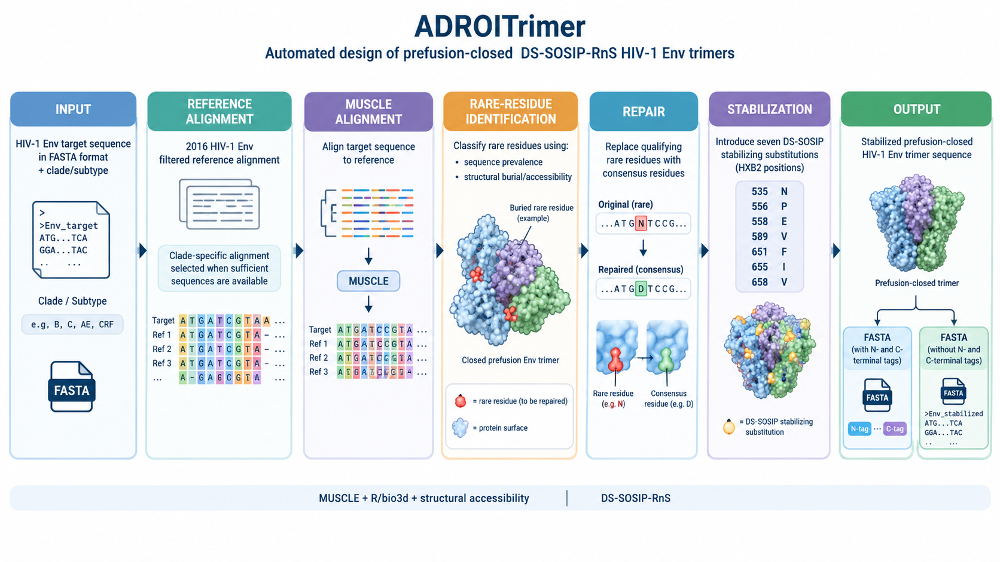

# ADROITrimer RnS-DS-SOSIP QC Dashboard

A Shiny dashboard that reads the output of [ADROITrimer](https://github.com/RedaRawi/ADROITrimer)
(Rawi *et al.* 2020, *Cell Reports*, [doi:10.1016/j.celrep.2020.108432](https://doi.org/10.1016/j.celrep.2020.108432))
and confirms which of the fixed RnS-DS-SOSIP structural mutations were successfully
introduced for a given HIV-1 Env strain, which are missing, and what the strain-specific
consensus "repair" substitutions were.

## Quick Information:


** This image was generated by chatgpt (source: https://chatgpt.com/) using biorender (source: https://www.biorender.com/)

NOTE: The code was also written with assistance from Claude AI (source: https://claude.ai/new)

## Required R packages

```r
install.packages(c("shiny", "shinydashboard", "DT", "dplyr",
                    "stringr", "tidyr", "readr", "ggplot2",
                    "curl", "jsonlite", "promises", "later"))   # last four: AI Assistant
```
(or the equivalent `r-cran-*` apt packages on Ubuntu/Debian.)

## Run it

```bash
Rscript -e 'shiny::runApp("app.R")'
```

## What it checks

`ADROITrimer1.0-3.R`'s "Additional mutations" block hardcodes the same 18 structural
positions on every run, regardless of input strain:

| Category | HXB2 positions | Count |
|---|---|---|
| DS (disulfide) | 201, 433 | 2 |
| SOSIP | 501, 559, 605 | 3 |
| 6R (furin cleavage site) | 508, 509, 510, 511, 511a, 511b | 6 |
| Stabilization | 535, 556, 588, 589, 651, 655, 658 | 7 |
| 3mut (apex) | 302 (N302M), 320 (T320L), 329 (A329P) | 3 |
| 2G (glycine helix-breakers) | 569 (569G), 636 (636G) | 2 |

23 positions in total. The 3mut and 2G rows are matched on the `Mutation` labels
`3mut` and `2G` in `Mutations.csv` (case-insensitive). 3mut/2G definitions come from
Ou et al. 2020, *J Virol* (RnS-3mut-2G-SOSIP.664); the 2G wild-type residues were not
confirmed, so they are left blank (matching uses position + category only).

These are read from the code (`ADROITrimer1.0-3.R` lines ~570-680) and cross-checked
against Figure 1 of Rawi *et al.* 2020, which lists the same structure-based
stabilization set (535N, 556P, 588E, 589V, 651F, 655I, 658V).

Everything else ADROITrimer changes is a **consensus repair** — a rare/non-consensus
residue swapped for the subtype-consensus amino acid at that position — and is
strain-specific by design, so it's tracked separately (Repair Mutations tab) rather
than checked against a fixed list.

## Input files

- **Required, per strain:** `Mutations.csv` (columns `Position, HXB2, Mutation`), written
  by `ADROITrimer1.0-3.R`. **Note:** the pipeline writes this to a fixed filename every
  run (it does not get the `output.prefix` the other output files get), so rename or
  copy it per strain (e.g. `CAP256_Mutations.csv`) before uploading if you're comparing
  multiple strains — the dashboard uses the uploaded filename as the strain label.
  The Upload tab's file picker accepts multiple `Mutations.csv` files at once, so a
  whole batch of strains can be loaded in a single upload.

## AI Assistant (offline)

The **AI Assistant** tab chats with a local [Ollama](https://ollama.com) server
(default model `dolphin3:8b`); nothing leaves your machine.

```bash
ollama pull dolphin3:8b     # once, needs internet
ollama serve                # then start the app as usual
```

Override with env vars `ADROIT_OLLAMA_URL` (default `http://127.0.0.1:11434`) and
`ADROIT_OLLAMA_MODEL`. The loaded-strain checklist/repair data is passed to the model
as context (untick the box to withhold it). Small models can be wrong: treat answers
as a QC aid.

## Tabs

- **Upload** — load one or more strains at once (multi-file `Mutations.csv` upload);
  click a row in the loaded-strains table to switch which one is "active" for the
  single-strain tabs.
- **RnS Checklist** — the 18-position table for the active strain, Present/Missing.
- **Repair Mutations** — the active strain's consensus repair substitutions (variable
  count).
- **Sequence Map** — a genome/gene-track view of Env (gp120 / gp41 backbone). Detected
  mutations are drawn as lollipops above the backbone, positioned by HXB2 coordinate and
  colored by category; missing checklist positions are open red circles on dashed stems
  below the backbone.
- **AI Assistant** — offline chat about the loaded strains (see above).
- **Batch Compare** — a heatmap + table of checklist status across every loaded strain.

## Recent changes

- Removed the optional `*_repaired_mutList.txt` cross-check upload and the Repair
  Mutations tab's corresponding valuebox — repair counts now come from `Mutations.csv`
  alone.
- Sequence Map redrawn as a gene-track/lollipop diagram (gp120/gp41 backbone with
  mutation lollipops above and missing-position markers below) instead of a flat
  strip of points, which fixes markers being hard to see against the dark background.
- The Upload tab's `Mutations.csv` file input now accepts multiple files in one
  selection, so a batch of strains can be loaded in a single action instead of one
  upload-and-click cycle per strain.

## Notes / assumptions

- unable to find a stored "neut dashboard" theme spec, so I matched the visual
  language already used across your other Shiny apps in this workspace (shinydashboard
  shell, `rv` reactiveValues store, DT tables, status colour-coding) with a dark
  navy/teal palette and green/red present/missing badges typical of neutralization-assay
  dashboards. Happy to swap in exact colors/fonts if you paste the CSS or a screenshot.
- The checklist and parsing logic were validated against synthetic `Mutations.csv`
  fixtures using `shiny::testServer()` (upload → active-strain switch → checklist
  status → batch pivot → duplicate-label handling → clear-all), not just eyeballed —
  see the reasoning trace if you want the test files.
- Sequence-level re-verification (actually reading the amino acid at each HXB2
  position out of the `*_DS-SOSIP-RnS_NtCt-tags.fasta`) is intentionally out of scope:
  the post-truncation renumbering in the script (N-terminal removal, tag insertion) is
  fragile to reproduce independently, so the dashboard treats `Mutations.csv` — the
  pipeline's own record of what it did — as ground truth. If you want that extra
  sequence-level cross-check added, let me know and I can build it against a real
  `*_DS-SOSIP-RnS_NtCt-tags.fasta` file.
